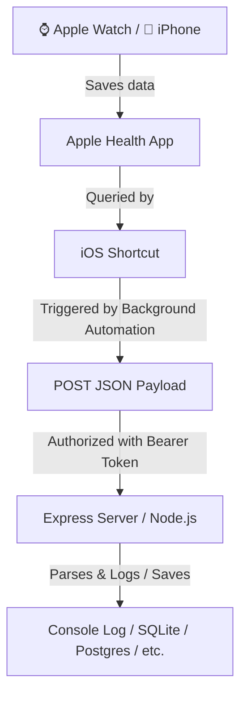

# HealthKit Relay 📱⚡

[](https://opensource.org/licenses/MIT)
[](https://nodejs.org/)
[](https://www.typescriptlang.org/)

A production-ready, lightweight, **zero-iOS-code** solution to automatically relay your Apple Health data (Steps, Active Energy, Workouts) to your own personal web server. 

No Swift, no Apple Developer Account, no App Store downloads required. Built entirely using the native **iOS Shortcuts** (Kestirmeler) app and a lightweight **Node.js + Express (TypeScript)** webhook receiver.

---

## 🏛️ Architecture Overview



1. **Client (iOS Shortcut)**: Runs natively in the background on your iOS device. It queries your local Apple Health database, aggregates daily step counts and active energy, compiles recent workouts, formats the results into JSON, and sends a secure HTTP POST request.
2. **Server (Express Webhook)**: A lightweight Node.js service secured with a Bearer Token. It receives the JSON payload, validates the authorization headers, parses the health metrics, and prints a formatted log (which you can easily route to a database, file, or visualization dashboard).

---

## 🛠️ Server Setup & Deployment

### Prerequisite
Ensure you have [Node.js](https://nodejs.org/) (v18.0.0 or higher) installed.

### 1. Clone & Install Dependencies
```bash
git clone https://github.com/yourusername/healthkit-relay.git
cd healthkit-relay
npm install
```

### 2. Configure Environment Variables
Copy the example environment file:
```bash
cp .env.example .env
```
Open `.env` and configure your port and API secret key:
```ini
PORT=3000
HEALTHKIT_API_KEY=hkrelay_8f99e4e2a6b24d77bb451df6b5c3ff90
NODE_ENV=development
```
> [!IMPORTANT]
> Change the `HEALTHKIT_API_KEY` in production to a secure random string (e.g. `openssl rand -hex 32`).

### 3. Run the Server
* **Development Mode** (auto-reloads on changes using `ts-node-dev`):
  ```bash
  npm run dev
  ```
* **Production Build & Start**:
  ```bash
  npm run build
  npm start
  ```

---

## 📱 iOS Shortcut Setup Guide (English & Türkçe)

This guide details exactly how to build the native iOS Shortcut. You can open the **Shortcuts (Kestirmeler)** app on your iPhone and follow these steps to build the sync flow.

### Step 1: Query Daily Steps
1. Add a **Find Health Samples** (`Sağlık Kayıtlarını Bul`) action:
   - Set **Type** (`Tür`) to **Steps** (`Adım`).
   - Add Filter: **Start Date** (`Başlangıç Tarihi`) is **Today** (`Bugün`).
   - Leave grouping as `None` and sorting as `Latest First`.
2. Add a **Calculate Statistics** (`İstatistikleri Hesapla`) action:
   - Set properties to calculate the **Sum** (`Toplam`) of **Health Samples** (`Sağlık Kayıtları`).
   - *This outputs your total steps. Let's refer to this output variable as `StepsToday`.*

### Step 2: Query Daily Active Energy
1. Add a **Find Health Samples** (`Sağlık Kayıtlarını Bul`) action:
   - Set **Type** (`Tür`) to **Active Energy** (`Aktif Enerji`).
   - Add Filter: **Start Date** (`Başlangıç Tarihi`) is **Today** (`Bugün`).
2. Add a **Calculate Statistics** (`İstatistikleri Hesapla`) action:
   - Set properties to calculate the **Sum** (`Toplam`) of **Health Samples** (`Sağlık Kayıtları`).
   - *This outputs your total active calories. Let's refer to this output variable as `ActiveEnergyToday`.*

### Step 3: Query Recent Workouts (Loop)
1. Add a **Find Workouts** (`Antrenmanları Bul`) action:
   - Add Filter: **Start Date** (`Başlangıç Tarihi`) is in the **Last 24 hours** (`Son 24 saat içinde`).
   - Sort by: **Start Date** (`Başlangıç Tarihi`) -> **Latest First** (`Önce En Yeniler`).
   - Enable Limit: Set **Get** to `5` workouts (to prevent payload bloat).
2. Add a **Repeat with Each** (`Her Biri İçin Yinele`) action:
   - Set it to repeat through the output of **Workouts**.
3. Inside the repeat block, add a **Dictionary** (`Sözlük`) action with the following key-value mappings:
   - `type` ➔ `Repeat Item` (`Yinelenen Öğe`) -> **Workout Type** (`Antrenman Türü`)
   - `startDate` ➔ `Repeat Item` -> **Start Date** (Format: *ISO 8601* format `yyyy-MM-dd'T'HH:mm:ssZZZZZ`)
   - `endDate` ➔ `Repeat Item` -> **End Date** (Format: *ISO 8601* format `yyyy-MM-dd'T'HH:mm:ssZZZZZ`)
   - `durationSeconds` ➔ `Repeat Item` -> **Duration** (`Süre`) (ensure it is parsed as a number)
   - `activeEnergyBurned` ➔ *Create nested Dictionary*:
     - `value` ➔ `Repeat Item` -> **Total Calories** (`Toplam Kalori`)
     - `unit` ➔ `kcal` (Text)
   - `distance` ➔ *Create nested Dictionary*:
     - `value` ➔ `Repeat Item` -> **Total Distance** (`Toplam Mesafe`)
     - `unit` ➔ `km` (Text)
4. *The Shortcut automatically collects these loop dictionaries into a list. Let's refer to this output variable as `WorkoutList`.*

### Step 4: Construct the Final Payload
1. Add a **Get Device Details** (`Aygıt Ayrıntılarını Al`) action:
   - Set it to get the **Device Name** (`Aygıt Adı`).
2. Add a **Dictionary** (`Sözlük`) action representing the root JSON payload:
   - `timestamp` ➔ Current Date (Format: *ISO 8601* format `yyyy-MM-dd'T'HH:mm:ssZZZZZ`)
   - `device` ➔ Output of **Get Device Details**
   - `metrics` ➔ *Create nested Dictionary*:
     - `steps` ➔ *Create nested Dictionary*:
       - `value` ➔ `StepsToday` (number, default to `0` if empty)
       - `unit` ➔ `count` (Text)
     - `activeEnergy` ➔ *Create nested Dictionary*:
       - `value` ➔ `ActiveEnergyToday` (number, default to `0` if empty)
       - `unit` ➔ `kcal` (Text)
   - `workouts` ➔ `WorkoutList` (the compiled workout dictionary array variable)

### Step 5: Send POST Request to Webhook Server
1. Add a **Get Contents of URL** (`URL İçeriğini Al`) action:
   - Set the URL to: `http://<your-server-ip-or-domain>:<port>/api/webhook/apple-health`
   - Expand the action settings and select Method: **POST**.
   - Add **Headers**:
     - Key: `Authorization` | Value: `Bearer <your_configured_api_key>`
   - Set **Request Body** to **JSON**.
   - Set the body contents to the **Dictionary** created in **Step 4**.

---

## ⚡ Background Automation Setup

To make this query and sync run automatically without opening the Shortcuts app:

1. Open the **Shortcuts (Kestirmeler)** app on your iOS device.
2. Select the **Automation** (`Otomasyon`) tab at the bottom center.
3. Tap the **+** (plus) icon to create a new automation.
4. Select one of the following triggers:
   - **Time of Day** (`Günün Belirli Bir Saati`): E.g., daily at **11:59 PM** to sync your total steps and calories at the end of the day.
   - **When Workout Ends** (`Antrenman Bittiğinde`): Fires instantly every time you finish an Apple Watch or Apple Fitness workout.
5. In the configuration settings, check **Run Immediately** (`Hemen Çalıştır`) and uncheck **Notify When Run** (`Çalıştırıldığında Bildir`) so that the synchronization occurs silently in the background.
6. Set the automation action to run the Shortcut you created in the guide above.

---

## 🔒 Security Best Practices

For hosting your server on the public internet:
1. **Always Use HTTPS**: Protect your Bearer token and health data in transit. Standardize on TLS (using services like Cloudflare, Caddy, or Nginx with Let's Encrypt).
2. **Reverse Proxy Setup**: Run the Node.js application behind a reverse proxy (like Nginx) or inside a secure container environment.
3. **API Token Rotation**: Regularly rotate your `HEALTHKIT_API_KEY` token.

---

## 💡 Troubleshooting

* **Local Server Not Accessible**: If your server is running locally on your computer and you are testing the shortcut on your phone, ensure both devices are connected to the same Wi-Fi network. Use your computer's local IP address (e.g. `http://192.168.1.50:3000/...`) instead of `localhost` or `127.0.0.1` in the iOS Shortcut.
* **Local Network Permission**: iOS requires local network access permissions for the Shortcuts app if contacting an IP address on your private subnet. Verify this in `Settings` ➔ `Shortcuts` ➔ `Allow Local Network`.
* **Shortcut Fails silently**: Use the "Quick Look" (`Hızlı Göz At`) action in the Shortcuts app immediately after constructing dictionaries or fetching URLs to inspect intermediary values during debugging.
